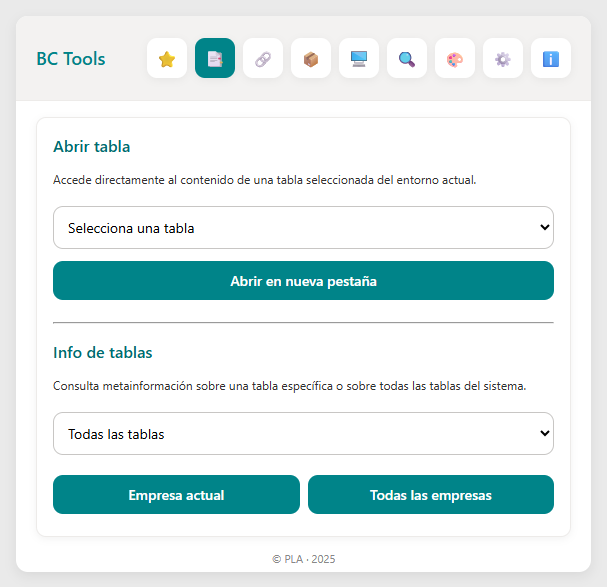
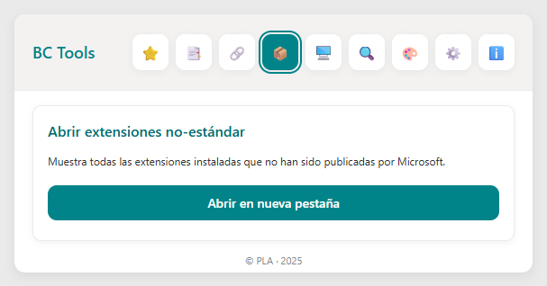
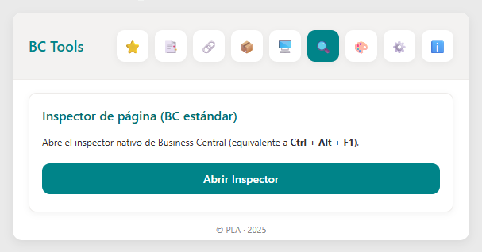
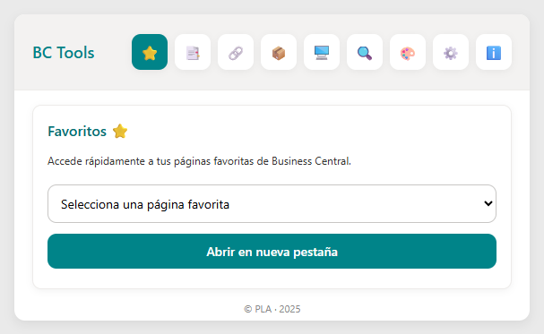
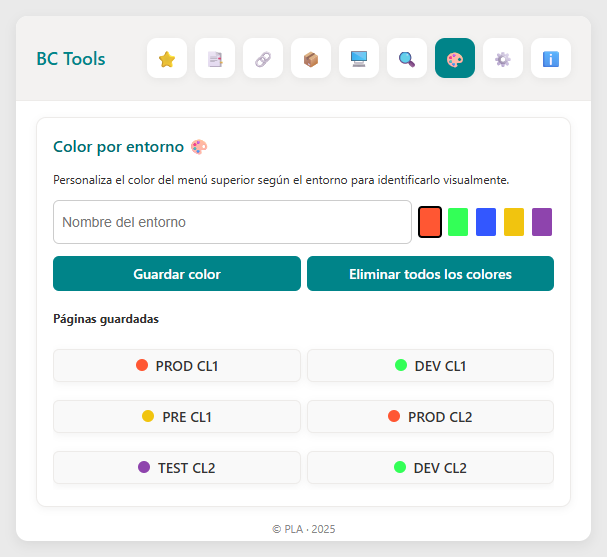

# ⚙️ BC Tools — Extensión para Microsoft Dynamics 365 Business Central (SaaS)

**BC Tools** es una extensión diseñada específicamente para entornos **SaaS de Microsoft Dynamics 365 Business Central**, orientada a facilitar el trabajo diario de **administradores, desarrolladores y usuarios avanzados**.  
Su propósito es centralizar y simplificar el acceso a herramientas clave de administración y desarrollo dentro de un único panel accesible desde el navegador.

---

## 🚀 Características principales

### 🔢 Acceso directo a tablas internas
Permite abrir tablas internas de Business Central directamente desde el ID, facilitando la inspección de datos y estructuras del sistema.

---

### 👥 Sesiones activas
Visualiza las sesiones activas en el entorno, ideal para identificar usuarios conectados en tiempo real y analizar posibles bloqueos o cuellos de botella.

---

### 🧩 Extensiones no estándar
Muestra un listado de las extensiones personalizadas instaladas, ayudando a controlar desarrollos propios o externos a Microsoft.

---

### 🔍 Inspector de páginas
Proporciona información técnica de la página actual: ID, tabla asociada, tipo y más. Muy útil para desarrolladores que trabajan en personalizaciones.

---

### ⭐ Favoritos personalizados
Permite guardar y acceder rápidamente a las páginas más utilizadas sin tener que buscarlas cada vez.  
Ideal para mejorar la productividad en tareas repetitivas.

---

### 🎨 Colores por entorno
Personaliza el color de la barra superior según el entorno (producción, pruebas, desarrollo...), evitando confusiones y errores al trabajar con múltiples entornos.

---

## 🧭 Instalación

Puedes instalar **BC Tools** directamente desde el marketplace oficial de Microsoft Edge:

🔗 [BC Tools — Microsoft Edge Add-ons](https://microsoftedge.microsoft.com/addons/detail/bc-tools/foenkdmnckjgmilbjjngmokjemmhgbge)

Una vez instalada, el icono aparecerá en la barra de extensiones del navegador.  
Al abrirlo, tendrás acceso inmediato a todas las herramientas descritas.

---

## 💡 Compatibilidad

- **Entornos:** Microsoft Dynamics 365 Business Central (SaaS)
- **Navegador:** Microsoft Edge (próximamente disponible también para Google Chrome)
- **Configuración:** No requiere pasos adicionales.  
  La extensión detecta automáticamente el entorno de BC donde se utiliza.

---

## 🧑‍💻 Desarrollado por

**PLA · © 2025**

---

## 📬 Contacto

Si deseas proponer nuevas funcionalidades o reportar algún error, puedes abrir un *issue* en este repositorio o contactarme directamente a través de [LinkedIn](https://www.linkedin.com/in/peio-llano-abasolo-116551260/).

---
